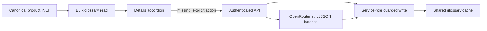

# Ingredient Details and Glossary - Plan Brief

> Full plan: `context/changes/ingredient-details-and-glossary/plan.md`
> Research: `context/changes/ingredient-details-and-glossary/research.md`

## What & Why

Dodajemy do szczegółów produktu rozwijane opisy INCI po polsku. Użytkownik ma szybko zrozumieć rolę składnika, jego typowe korzyści i ograniczenia, bez mylenia tej wiedzy z osobistą oceną produktu względem własnej skóry.

## Starting Point

Produkt ma już wspólną listę INCI i canonical details page, ale lista jest dziś statyczna. Istniejąca analiza produktu jest prywatna, zależy od profilu użytkownika i nie może stanowić współdzielonego słownika.

## Desired End State

Każda pozycja INCI ma lokalnie rozwijany opis, a tylko jeden składnik jest otwarty naraz. Jeśli opisów brakuje, użytkownik uruchamia jedno ograniczone przygotowanie dla produktu; wyniki są potem współdzielone między produktami i użytkownikami. Błędy nie ukrywają gotowych wyników, a starsze opisy odświeża się ręcznie.

## Key Decisions Made

| Decision | Choice | Why | Source |
| --- | --- | --- | --- |
| Storage boundary | Shared glossary keyed by normalized INCI | Descriptions nie zależą od użytkownika ani pojedynczego produktu. | Research |
| Content source | Shared AI-generated Polish copy | Działa dla dowolnego zatwierdzonego INCI bez nowego zewnętrznego API. | Plan |
| Generation timing | Explicit product-level action | Nie ma ukrytych kosztów ani AI requestów po rozwinięciu wiersza. | Plan |
| Failure behavior | Preserve ready entries and retry failures only | Częściowy sukces nadal daje użytkownikowi wartość. | Plan |
| Freshness | Show stale copy, refresh manually | Jakość może rosnąć bez automatycznych re-generacji. | Plan |
| Interaction | One-open-item accordion | Długa lista pozostaje czytelna na telefonie i desktopie. | Plan |
| Write security | Server-only Supabase service role | Zwykły użytkownik ma wyłącznie odczyt wspólnego słownika. | Research / Plan |

## Scope

**In scope:**

- współdzielona tabela cache'a opisów INCI z lifecycle i RLS;
- konserwatywna normalizacja klucza INCI;
- server-only write path, strict JSON OpenRouter batch i retry/freshness lifecycle;
- akordeon INCI na details oraz stany loading/error/partial/stale;
- dokumentacja sekretu service-role i workflow `migration up`.

**Out of scope:**

- zewnętrzna baza naukowa składników i linkowane źródła;
- automatyczne generowanie przy wejściu na stronę lub intake;
- ocena całej formuły, porady medyczne i personalizacja opisu składnika;
- panel administracyjny, job queue i nowy framework testowy.

## Architecture / Approach

The client never submits INCI strings or explanation text. It submits only a product ID and allowed action; the server derives canonical ingredients, generates bounded batches, and returns cache state.

## Phases at a Glance

| Phase | What it delivers | Key risk |
| --- | --- | --- |
| 1. Shared contract | Table, RLS, normalized identity and server-only client | Exposing shared write permissions accidentally |
| 2. Enrichment API | Strict AI batches, lifecycle and partial retry | Invalid/partial provider JSON or duplicated concurrent work |
| 3. Details experience | Accessible one-open accordion and product-level action | Keeping state clear without URL messages or per-click calls |

**Prerequisites:** local Supabase running, `OPENROUTER_API_KEY`, and a server-only `SUPABASE_SERVICE_ROLE_KEY` configured locally and in deployment.
**Estimated effort:** around 2-3 implementation sessions across 3 phases.

## Open Risks & Assumptions

- AI-produced copy is educational and must remain cautious; it is not a source-backed scientific reference.
- A very large INCI list may take multiple bounded operations; normal formulas should fit within the 48-entry operation limit.
- The service-role key is operationally necessary for safe shared writes and must be provisioned before manual API verification.

## Success Criteria (Summary)

- A user can prepare, expand and revisit cached Polish descriptions without requests on row expansion.
- The same normalized INCI is reused across product details, while personal product-fit analysis remains separate.
- Provider/configuration failure remains visible and retryable, never alters URLs, and never grants direct browser write access to shared glossary data.
