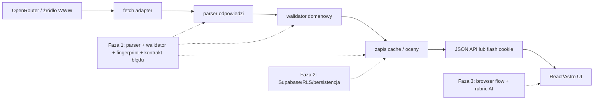

## Question

Jak wprowadzić pierwszą bazę testów dla ryzyk `#1`, `#3` i `#5` z [planu testów](../../foundation/test-plan.md), tak aby najpierw objąć deterministyczne kontrakty AI, świeżość zapisanych analiz i bezpieczne błędy, bez przedwczesnego budowania pełnych testów przeglądarkowych albo resetowania bazy?

## Summary

Faza 1 powinna wprowadzić Vitest jako jedyny nowy runner oraz trzy wąskie grupy testów kontraktowych:

1. Walidację odpowiedzi AI dla rutyny: poprawna odpowiedź przechodzi, a odpowiedzi niepełne, z obcym produktem, nieistniejącym składnikiem INCI albo pominiętą parą produktów są odrzucane.
2. Deterministyczną świeżość: zmiana danych profilu, INCI, wersji promptu/modelu lub zawartości rutyny musi powodować zmianę decyzji o aktualności. Równe wejście musi dawać ten sam fingerprint.
3. Kontrakt błędów: ścieżki JSON dla wysp React pozostają na czystym URL-u, błąd ma polską i użyteczną treść, a nieudany request nie może sam zapisać propozycji ani zastąpić ostatniego poprawnego wyniku.

Nie należy w tej fazie symulować całego Supabase ani przeglądarki. Faktyczne RLS, zapis/odczyt po odświeżeniu i zachowanie formularza w przeglądarce pozostają odpowiednio w fazie 2 i 3 test planu. Nie wymaga to korekty strategii: obecny plan już rozdziela kontraktową część ryzyka `#3` od późniejszej integracji i e2e.

## Detailed Findings

### 1. Kontrakt AI rutyny jest wyraźny i deterministyczny

`parseRoutineAiProposal` jest właściwą granicą do testowania niezaufanej odpowiedzi modelu. Parser wymaga niepustej rutyny, użycia wyłącznie produktów z półki i pojedynczego uzasadnienia dla każdego wpisu. Dla edytowanej rutyny wymaga też pełnej oceny całego układu. [routine-ai.ts:370](https://github.com/Mradosi/Shelfie/blob/71d9ce57680bf8416d054c1c4bbd771d0660f8a4/src/lib/domain/routine-ai.ts#L370)

Ocena ma mocniejszy, mierzalny kontrakt niż sam prompt: każda para produktów w tej samej sekcji AM/PM musi mieć dokładnie jeden werdykt; cytowany składnik musi występować w dostarczonym INCI; istotny problem pary musi trafić także do widocznych ustaleń, a wtedy status całej oceny musi wskazywać uwagę. [routine-ai.ts:147](https://github.com/Mradosi/Shelfie/blob/71d9ce57680bf8416d054c1c4bbd771d0660f8a4/src/lib/domain/routine-ai.ts#L147) [routine-ai.ts:228](https://github.com/Mradosi/Shelfie/blob/71d9ce57680bf8416d054c1c4bbd771d0660f8a4/src/lib/domain/routine-ai.ts#L228)

To bezpośrednio chroni przed zgłaszanym wcześniej przypadkiem, w którym model pominął interakcję produktów. Testy nie będą udowadniać merytorycznej dermatologicznej prawdziwości opinii, ale zablokują odpowiedź, która nie przeanalizowała wszystkich wymaganych par lub tworzy fikcyjne przesłanki.

Prompt rutyny przekazuje pełne INCI, profil, rolę kroku i wcześniejsze dopasowanie produktu. Nakazuje porównać każdą parę oraz użyć wyszukiwania internetowego, gdy w rutynie jest para produktów. [openrouter-routine-draft.ts:87](https://github.com/Mradosi/Shelfie/blob/71d9ce57680bf8416d054c1c4bbd771d0660f8a4/src/lib/integrations/openrouter-routine-draft.ts#L87) [openrouter-routine-draft.ts:91](https://github.com/Mradosi/Shelfie/blob/71d9ce57680bf8416d054c1c4bbd771d0660f8a4/src/lib/integrations/openrouter-routine-draft.ts#L91) Kod tylko loguje brak wyszukiwania, nie odrzuca takiej odpowiedzi. [openrouter-routine-draft.ts:142](https://github.com/Mradosi/Shelfie/blob/71d9ce57680bf8416d054c1c4bbd771d0660f8a4/src/lib/integrations/openrouter-routine-draft.ts#L142) Dlatego faza 1 nie powinna udawać, że test może potwierdzić użycie narzędzia przez model. To należy zostawić do selektywnego rubric review w fazie 3.

### 2. Dwa typy cache mają różne kontrakty świeżości

Analiza produktu jest stanem `pending`, `ready`, `failed` albo `stale`, przechowywanym per użytkownik i produkt. Baza zachowuje snapshot profilu i danych produktu użytych podczas generowania. [20260712120000_user_product_interpretations.sql:43](https://github.com/Mradosi/Shelfie/blob/71d9ce57680bf8416d054c1c4bbd771d0660f8a4/supabase/migrations/20260712120000_user_product_interpretations.sql#L43) [20260712120000_user_product_interpretations.sql:96](https://github.com/Mradosi/Shelfie/blob/71d9ce57680bf8416d054c1c4bbd771d0660f8a4/supabase/migrations/20260712120000_user_product_interpretations.sql#L96)

`getInterpretationStaleReason` determinuje brak aktualności na podstawie pełnego profilu, INCI/kategorii/pewności/aktualizacji produktu oraz wersji promptu i modelu. [product-interpretation.ts:312](https://github.com/Mradosi/Shelfie/blob/71d9ce57680bf8416d054c1c4bbd771d0660f8a4/src/lib/domain/product-interpretation.ts#L312) Następnie odczyt szczegółów produktu zapisuje status `stale`, jeżeli wejście się różni. [product-interpretation.ts:522](https://github.com/Mradosi/Shelfie/blob/71d9ce57680bf8416d054c1c4bbd771d0660f8a4/src/lib/domain/product-interpretation.ts#L522)

Ocena rutyny jest osobnym cache'em: model tworzy SHA-256 ze stabilnej serializacji profilu, bazowej rutyny, INCI, pewności INCI oraz wersji dopasowań produktów. [routine-ai-assessment.ts:77](https://github.com/Mradosi/Shelfie/blob/71d9ce57680bf8416d054c1c4bbd771d0660f8a4/src/lib/domain/routine-ai-assessment.ts#L77) [routine-ai-assessment.ts:113](https://github.com/Mradosi/Shelfie/blob/71d9ce57680bf8416d054c1c4bbd771d0660f8a4/src/lib/domain/routine-ai-assessment.ts#L113) Strona rutyny pokazuje zapisany wynik wyłącznie, gdy jego fingerprint pasuje do aktualnego wejścia. [routine.astro:78](https://github.com/Mradosi/Shelfie/blob/71d9ce57680bf8416d054c1c4bbd771d0660f8a4/src/pages/routine.astro#L78)

Wniosek: faza 1 może pewnie sprawdzić decyzje i fingerprint bez Supabase. To nie dowodzi jeszcze, że wynik faktycznie przetrwa odświeżenie albo że RLS zadziała; te dowody muszą należeć do fazy 2.

### 3. Błąd AI ma zachować sterowalność, nie sukces pozorny

Wyspa rutyny wykonuje najpierw przygotowanie analiz produktów, następnie generowanie propozycji, a ewentualne rekomendacje katalogowe dopiero później. Przy błędzie przechodzi do stanu `error`, pozostawiając istniejący draft nietknięty. [RoutineWorkspace.tsx:168](https://github.com/Mradosi/Shelfie/blob/71d9ce57680bf8416d054c1c4bbd771d0660f8a4/src/components/routine/RoutineWorkspace.tsx#L168) Zastosowanie propozycji zapisuje ją osobnym requestem i dopiero po jego sukcesie zastępuje `savedDraft`, czyści propozycję i zamyka modal. [RoutineWorkspace.tsx:229](https://github.com/Mradosi/Shelfie/blob/71d9ce57680bf8416d054c1c4bbd771d0660f8a4/src/components/routine/RoutineWorkspace.tsx#L229)

Podobnie panel analizy produktu zachowuje poprzednią interpretację, a niepowodzenie pokazuje komunikat i akcję ponowienia. [ProductInterpretationPanel.tsx:109](https://github.com/Mradosi/Shelfie/blob/71d9ce57680bf8416d054c1c4bbd771d0660f8a4/src/components/products/ProductInterpretationPanel.tsx#L109) [ProductInterpretationPanel.tsx:192](https://github.com/Mradosi/Shelfie/blob/71d9ce57680bf8416d054c1c4bbd771d0660f8a4/src/components/products/ProductInterpretationPanel.tsx#L192)

API dla wysp zwraca JSON `{ error }`; błędy nie są przekazywane query stringiem. [routine/ai.ts:47](https://github.com/Mradosi/Shelfie/blob/71d9ce57680bf8416d054c1c4bbd771d0660f8a4/src/pages/api/domain/routine/ai.ts#L47) Dla tras z przekierowaniem aplikacja używa jednorazowego, `HttpOnly` flash cookie zamiast odpowiedzi w URL-u. [flash-message.ts:13](https://github.com/Mradosi/Shelfie/blob/71d9ce57680bf8416d054c1c4bbd771d0660f8a4/src/lib/flash-message.ts#L13) To jest też zapisana reguła projektu w `context/foundation/lessons.md`.

Jest luka do zamknięcia w planie: kilka endpointów zwraca użytkownikowi surowe `error.message`, a `last_error` z analizy produktu jest później renderowany. Na przykład endpoint analizy produktu przekazuje treść wyjątku zarówno przy błędzie autoryzacji, jak i generowania. [interpretation.ts:38](https://github.com/Mradosi/Shelfie/blob/71d9ce57680bf8416d054c1c4bbd771d0660f8a4/src/pages/api/domain/products/interpretation.ts#L38) [interpretation.ts:95](https://github.com/Mradosi/Shelfie/blob/71d9ce57680bf8416d054c1c4bbd771d0660f8a4/src/pages/api/domain/products/interpretation.ts#L95) Faza 1 powinna więc zdefiniować i przetestować jedną granicę tłumaczenia błędów: logi zachowują szczegóły techniczne i trace ID, ale JSON dla użytkownika zawiera polski komunikat oraz możliwą następną akcję, bez surowej odpowiedzi providera.

### 4. Product intake ma osobny, tolerancyjny parser odpowiedzi modelu

Wyszukiwanie produktu toleruje JSON otoczony prose lub blokiem Markdown i odzyskuje pierwszy poprawny obiekt. [openrouter.ts:436](https://github.com/Mradosi/Shelfie/blob/71d9ce57680bf8416d054c1c4bbd771d0660f8a4/src/lib/integrations/openrouter.ts#L436) [openrouter.ts:486](https://github.com/Mradosi/Shelfie/blob/71d9ce57680bf8416d054c1c4bbd771d0660f8a4/src/lib/integrations/openrouter.ts#L486) Rutyna używa za to `response_format: json_object` i celowo stosuje ścisły `JSON.parse` przed walidacją domenową. [openrouter-routine-draft.ts:70](https://github.com/Mradosi/Shelfie/blob/71d9ce57680bf8416d054c1c4bbd771d0660f8a4/src/lib/integrations/openrouter-routine-draft.ts#L70) [openrouter-routine-draft.ts:149](https://github.com/Mradosi/Shelfie/blob/71d9ce57680bf8416d054c1c4bbd771d0660f8a4/src/lib/integrations/openrouter-routine-draft.ts#L149)

To są różne kontrakty, nie duplikacja do ujednolicenia bez decyzji produktowej. Testy fazy 1 mają je opisywać niezależnie: intake ma rozpoznać poprawny wariant mimo opakowania tekstem, a rutyna ma odrzucić każde naruszenie ścisłego kontraktu po stronie domeny.

UI intake utrzymuje dane wyszukiwania i przechodzi do wyboru wariantu tylko po odpowiedzi `ambiguous`; przy błędzie wyświetla komunikat w tym samym kroku. [ProductIntakeFlow.tsx:454](https://github.com/Mradosi/Shelfie/blob/71d9ce57680bf8416d054c1c4bbd771d0660f8a4/src/components/products/ProductIntakeFlow.tsx#L454) Pełne sprawdzenie tego zachowania w przeglądarce należy do fazy 3, ale parser i kontrakt odpowiedzi mogą mieć testy jednostkowe już teraz.

## Recommended Test Design

### Test runner i granice mockowania

- Dodać `vitest` oraz jeden skrypt uruchamiający testy TypeScript w środowisku `node`. Nie dodawać jeszcze Playwright, kontenera Astro ani realnego klienta Supabase.
- Mockować tylko granicę providera (`fetch`) tam, gdzie test dotyczy mapowania odpowiedzi providera. Nie mockować parsera ani walidatora, bo to one są przedmiotem testu.
- Korzystać ze statycznych fixture'ów: minimalna półka z dwoma produktami, profilem i prawdziwymi fragmentami INCI. Nie kopiować całego promptu do oczekiwań.
- Testy nie mogą wykonywać requestów do OpenRouter, źródeł WWW ani Supabase. Muszą być szybkie, powtarzalne i bez sekretów.

### Minimalny zestaw testów do zaplanowania

| Obszar                                 | Przypadki o wysokim sygnale                                                                                                                                     | Warstwa              |
| -------------------------------------- | --------------------------------------------------------------------------------------------------------------------------------------------------------------- | -------------------- |
| `parseRoutineAiProposal`               | poprawna ocena dwóch produktów; brak jednej pary; cytat spoza INCI; para spoza sekcji; istotny werdykt bez widocznego ustalenia; obcy `shelf_item_id`           | unit/contract        |
| `getInterpretationStaleReason`         | identyczne wejście; zmiana profilu; zmiana INCI; zmiana promptu/modelu; status inny niż `ready`                                                                 | unit                 |
| `createRoutineAiAssessmentFingerprint` | identyczne wejście daje ten sam hash; zmiana profilu, wpisu rutyny, INCI lub wersji dopasowania daje inny hash; brak produktu użytego w rutynie jest błędem     | unit                 |
| error contract                         | błąd providera/walidacji jest zamieniony w stabilny polski komunikat dla JSON; szczegół techniczny zostaje tylko w logu; nie ma przekierowania ani danych w URL | contract integration |
| intake parser                          | JSON, JSON w fenced blocku i tekst z jednym poprawnym obiektem; brak obiektu kończy się kontrolowanym błędem                                                    | unit                 |

### Co celowo przesuwamy

- Zapis `upsert`, ponowny odczyt i RLS tabel `user_product_interpretations` oraz `user_routine_assessments` do fazy 2. Migracje definiują trwałość i izolację, ale nie ma obecnie testowego Supabase ani potrzeby wprowadzania resetów bazy. [20260731033458_routine_ai_assessments.sql:1](https://github.com/Mradosi/Shelfie/blob/71d9ce57680bf8416d054c1c4bbd771d0660f8a4/supabase/migrations/20260731033458_routine_ai_assessments.sql#L1)
- Przetrwanie wpisanego e-maila, pola formularza lub otwartego modalu po błędzie sieciowym do fazy 3: wymaga prawdziwego DOM i flow użytkownika, więc unit test dawałby pozorny sygnał.
- Ocena semantyczna porad skórnych, w tym wykrywanie każdej możliwej interakcji, do rubric review z fazy 3. Deterministyczny kontrakt może wymusić kompletność danych, nie medyczną prawdę.

## Architecture

Najbardziej stabilną granicą jest `parser -> walidator domenowy`. Provider może zwrócić nieprzewidziany tekst, lecz produkt nie może przejść dalej bez walidacji. Cache jest kolejną granicą: stale dane mogą pozostać wyświetlone jako ostatni wynik, ale muszą być jasno oznaczone i nie mogą być uznane za aktualne.

## Historical Context

- Użytkownik wskazał jako najważniejsze ryzyka: nieadekwatne odpowiedzi AI, błędne dane produktu, pozornie zapisany stan znikający po odświeżeniu oraz nieaktualne analizy.
- W trakcie implementacji pojawiały się błędy odpowiedzi OpenRouter: JSON opakowany w Markdown, nieaktualny URL źródła oraz niepełna ocena interakcji produktów. Obecne parsery i walidator są odpowiedzią na te incydenty, dlatego są pierwszym kandydatem do regresji.
- Projekt ma trwałą zasadę: komunikaty odpowiedzi nie trafiają do URL. Dla przekierowań używa flash cookie, dla wysp JSON. Nie należy przywracać query-parametrów z błędami.

## Related Code

- [Walidacja propozycji i oceny rutyny](https://github.com/Mradosi/Shelfie/blob/71d9ce57680bf8416d054c1c4bbd771d0660f8a4/src/lib/domain/routine-ai.ts#L147)
- [Fingerprint i cache oceny rutyny](https://github.com/Mradosi/Shelfie/blob/71d9ce57680bf8416d054c1c4bbd771d0660f8a4/src/lib/domain/routine-ai-assessment.ts#L60)
- [Świeżość i lifecycle dopasowania produktu](https://github.com/Mradosi/Shelfie/blob/71d9ce57680bf8416d054c1c4bbd771d0660f8a4/src/lib/domain/product-interpretation.ts#L312)
- [Adapter AI dla rutyny](https://github.com/Mradosi/Shelfie/blob/71d9ce57680bf8416d054c1c4bbd771d0660f8a4/src/lib/integrations/openrouter-routine-draft.ts#L44)
- [Parser i adapter AI web search](https://github.com/Mradosi/Shelfie/blob/71d9ce57680bf8416d054c1c4bbd771d0660f8a4/src/lib/integrations/openrouter.ts#L436)
- [Endpoint AI rutyny](https://github.com/Mradosi/Shelfie/blob/71d9ce57680bf8416d054c1c4bbd771d0660f8a4/src/pages/api/domain/routine/ai.ts#L232)
- [UI rutyny](https://github.com/Mradosi/Shelfie/blob/71d9ce57680bf8416d054c1c4bbd771d0660f8a4/src/components/routine/RoutineWorkspace.tsx#L123)
- [UI intake produktu](https://github.com/Mradosi/Shelfie/blob/71d9ce57680bf8416d054c1c4bbd771d0660f8a4/src/components/products/ProductIntakeFlow.tsx#L430)
- [Flash messages bez parametrów URL](https://github.com/Mradosi/Shelfie/blob/71d9ce57680bf8416d054c1c4bbd771d0660f8a4/src/lib/flash-message.ts#L1)

## Open Questions

Brak blokujących pytań. Plan powinien podjąć następujące decyzje techniczne:

1. Czy dla błędów providerów wprowadzić mały, wspólny mapper z kodami kategorii (`provider_unavailable`, `invalid_model_output`, `network_failure`), zamiast przekazywać `error.message`? Rekomendacja: tak, bo obecny surowy komunikat nie jest bezpiecznym kontraktem UI.
2. Czy testować strict JSON rutyny na adapterze `fetch`, czy wyłącznie na parserze domenowym? Rekomendacja: oba poziomy, ale tylko po jednym reprezentatywnym przypadku adaptera i pełną macierz nieprawidłowych danych na parserze domenowym.
3. Czy utrzymywać fixture'y INCI jako małe, celowo dobrane dane? Rekomendacja: tak; pełne dane katalogu nie zwiększą sygnału tych testów.

## Plan Readiness

Research jest gotowy do `/10x-plan testing-ai-contract-foundation`. Plan powinien ograniczyć fazę 1 do fundamentu Vitest, deterministycznych fixture'ów i kontraktów opisanych powyżej, a na końcu uzupełnić §6.1 oraz §6.5 `context/foundation/test-plan.md` o faktycznie wprowadzone wzorce i komendy.
