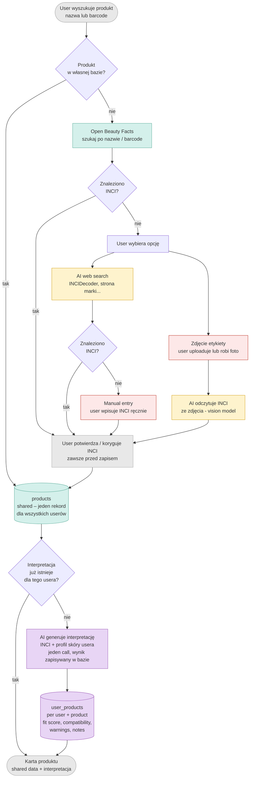

# Shelfie – Architektura produktu i decyzje projektowe

## Flow – diagram



---

## 1. Flow dodawania produktu

### Warstwa 1 – Wyszukiwanie w własnej bazie

Gdy user wyszukuje produkt (po nazwie lub barcode), aplikacja najpierw sprawdza własną bazę danych. Jeśli produkt już tam istnieje (bo wcześniej dodał go inny user), całe pobieranie zewnętrzne jest pomijane i aplikacja przechodzi bezpośrednio do wyświetlenia karty produktu. Własna baza rośnie z każdym nowym produktem i z czasem eliminuje potrzebę odpytywania zewnętrznych źródeł.

### Warstwa 2 – Open Beauty Facts

Jeśli produktu nie ma w bazie, aplikacja odpytuje Open Beauty Facts (OBF) – darmowe, otwarte API z bazą ponad 13 000 produktów kosmetycznych. OBF zwraca nazwę, markę, kategorię, listę składników INCI oraz zdjęcie opakowania. Dla mainstreamowych marek (CeraVe, La Roche-Posay, The Ordinary, COSRX i podobnych) pokrycie jest dobre.

### Warstwa 3 – Fallback: dwie równoległe opcje

Jeśli OBF nie zwróci składu, user widzi dwie równoległe opcje do wyboru:

**Opcja A – AI web search.** AI przeszukuje internet (INCIDecoder, strona marki, Sephora, sklepy kosmetyczne) i próbuje znaleźć listę składników. Wynik jest oznaczony jako "do weryfikacji" – AI może zwrócić dane z nieaktualnej wersji produktu lub ze złego regionu. Szybka, nie wymaga wysiłku od usera, ale mniej pewna.

**Opcja B – Zdjęcie etykiety.** User uploaduje zdjęcie opakowania lub robi je aparatem. Vision model odczytuje listę składników INCI ze zdjęcia. Wolniejsze i wymaga działania od usera, ale dane pochodzą bezpośrednio z opakowania które trzyma w ręku – są najbardziej wiarygodne ze wszystkich źródeł.

### Warstwa 4 – Manual entry

Niezależnie od wyniku poprzednich warstw, user zawsze może wpisać lub poprawić skład ręcznie. Manual entry jest też ostatecznym fallbackiem jeśli AI nic nie znajdzie i user nie chce robić zdjęcia.

### Potwierdzenie przed zapisem

Niezależnie od tego skąd dane przyszły – z OBF, z AI search, ze zdjęcia, czy ręcznie – user zawsze widzi wynik i potwierdza lub koryguje INCI przed zapisem. To wymaganie z PRD (FR-005) i kluczowy guardrail: dane nigdy nie są zapisywane bez akceptacji usera.

Po potwierdzeniu produkt trafia do tabeli `products` w bazie – raz, globalnie, dla wszystkich userów.

---

## 2. Model danych

### Tabela `products` – shared, globalna

Jeden rekord na produkt, niezależnie ilu userów go posiada. Tworzona raz, przy pierwszym dodaniu produktu przez kogokolwiek.

Pola:

- `id`
- `name`, `brand`, `category`
- `inci_list` – lista składników INCI
- `ingredient_groups` – tagi grup składnikowych wynikające z INCI, np. `retinoids`, `AHAs`, `niacinamide`, `high_alcohol`, `fragrance`
- `concern_tags` – tagi problemów skórnych które produkt adresuje, np. `['acne', 'hydration', 'brightening']`
- `image_url` – link do zdjęcia opakowania
- `inci_source` – źródło składu: `open_beauty_facts`, `photo_vision`, `manual`, `ai_web_search`
- `inci_confidence` – poziom pewności danych: `high`, `medium`
- `inci_updated_at` – timestamp ostatniej aktualizacji składu

### Tabela `users` – profil skóry

Pola:

- `id`
- `email`
- `skin_type`
- `concerns`
- `goals`
- `sensitivity`

### Tabela `user_products` – interpretacja per user

Łączy usera z produktem i przechowuje wszystko co jest spersonalizowane.

Pola:

- `id`
- `user_id`
- `product_id`
- `fit_score`
- `compatibility`
- `warnings`
- `personalized_notes`
- `user_notes`
- `user_reactions`
- `interpretation_valid`
- `added_at`

---

## 3. Shelf vs Routine

### Rozdzielenie konceptów

Shelf i routine są oddzielnymi konceptami produktu.

### Shelf

Shelf reprezentuje:

- produkty które user posiada,
- produkty które chce obserwować,
- produkty które potencjalnie chce wykorzystać w rutynie.

Produkt może istnieć na shelf bez bycia aktywnie używanym w rutynie.

### Routine

Routine:

- wykorzystuje wybrane produkty z shelf,
- definiuje sposób ich użycia.

Routine configuration określa:

- routine role,
- AM/PM,
- weekdays,
- frequency,
- order.

### AI routine generation

AI routine generation działa wyłącznie na produktach obecnych na shelf usera.

AI:

- analizuje produkty ze shelf,
- analizuje profil skóry,
- generuje suggested routine.

Generated routine wykorzystuje dokładnie ten sam model danych i UX co manual routine editing.

AI nie tworzy osobnego typu rutyny.

### Product lifecycle

Flow produktu:

```txt
Product catalog → My Shelf → Routine
```

Produkt:

1. istnieje w globalnej bazie,
2. trafia na shelf usera,
3. opcjonalnie zostaje użyty w rutynie.

---

## 4. Flow generowania interpretacji

Interpretacja jest generowana jednorazowo per para `(user, product)` i zapisywana w tabeli `user_products`. Nie jest generowana od nowa przy każdym wejściu na kartę produktu.

AI dostaje:

- listę INCI
- ingredient groups
- concern tags
- profil skóry usera

Na tej podstawie generuje:

- fit score
- compatibility
- warnings
- contextual notes

Jeśli profil skóry usera się zmieni, interpretacja może zostać zinwalidowana i przeliczona ponownie.

---

## 5. Wyświetlanie karty produktu

Frontend dostaje w jednym response:

### Shared product data

- nazwa
- marka
- zdjęcie
- category
- INCI
- ingredient groups
- concern tags

### User-specific interpretation

- fit score
- compatibility
- warnings
- personal notes
- reactions

Jeśli interpretacja nie istnieje lub jest nieaktualna, backend może zwrócić dane produktu od razu, a interpretację wygenerować asynchronicznie w tle.

---

## 6. Source confidence i data provenance

Przy każdym produkcie zapisujemy:

- `inci_source`
- `inci_confidence`
- `inci_updated_at`

Mapowanie:

| source            | confidence |
| ----------------- | ---------- |
| open_beauty_facts | high       |
| photo_vision      | high       |
| manual            | high       |
| ai_web_search     | medium     |

Dzięki temu:

- można wyświetlać disclaimery,
- różnicować wagę warningów,
- łatwiej utrzymywać bazę.

---

## 7. Role produktów w rutynie (routine roles)

### Decyzja

Produkty otrzymują dodatkowe metadata określające ich rolę w rutynie skincare.

Nie jest to personalizacja użytkownika ani concern tag, tylko semantyczna funkcja produktu w flow pielęgnacyjnym.

### Przykładowe role

Controlled vocabulary na MVP:

- `cleanser`
- `makeup_remover`
- `toner`
- `essence`
- `serum`
- `treatment`
- `exfoliant`
- `moisturizer`
- `spf`
- `eye_care`
- `mask`
- `spot_treatment`
- `oil`

Jeden produkt może mieć kilka ról.

Przykład:

```json
{
  "routine_roles": ["serum", "hydrator", "treatment"]
}
```

### Jak role są generowane

Role są generowane automatycznie przez AI podczas tworzenia produktu na podstawie:

- category,
- product name,
- ingredient groups,
- INCI.

User może je ewentualnie poprawić.

### Do czego są używane

Routine roles pozwalają deterministycznie:

- budować strukturę rutyny,
- sprawdzać brakujące kroki,
- filtrować produkty,
- grupować produkty w UI,
- wspierać recommendation engine,
- generować bardziej stabilne prompty dla AI.

### Relationship do innych metadata

Routine roles są oddzielne od:

#### Ingredient groups

Co produkt zawiera.

Np:

- `retinoids`
- `AHAs`
- `niacinamide`

#### Concern tags

Jakie problemy adresuje.

Np:

- `acne`
- `hydration`
- `anti_aging`

#### Personalized interpretation

Czy produkt pasuje do konkretnego usera.

Np:

- too irritating for sensitive skin,
- good for barrier repair,
- may worsen dryness.

---

## 8. Deterministyczne tagi vs AI interpretacja

### Na `products` – shared metadata

#### Ingredient groups

Obiektywne tagi wynikające bezpośrednio z INCI:

- `retinoids`
- `AHAs`
- `BHAs`
- `niacinamide`
- `vitamin_c`
- `fragrance`
- `high_alcohol`
- `occlusive`

#### Concern tags

Pół-deterministyczne tagi problemów skórnych:

- `acne`
- `hydration`
- `brightening`
- `anti_aging`
- `barrier_support`
- `sensitivity`

Są generowane przez AI jednorazowo przy tworzeniu produktu.

### Na `user_products` – personalizacja

Nie zapisujemy:

- `suitable_for_oily_skin`
- `good_for_sensitive_skin`

na poziomie produktu.

To jest interpretacja zależna od konkretnego usera i jego skóry.

### Dlaczego tagi są ważne

Pozwalają robić deterministycznie:

- filtrowanie produktów,
- porównanie produktów,
- shelf audit,
- recommendation ranking,
- conflict detection,
- listy produktów na konkretny problem.

Bez dodatkowych AI calli.

### Hybrid architecture

Deterministyczne tagi są triggerem i kontekstem.

AI:

- interpretuje,
- wyjaśnia,
- personalizuje.

Deterministic layer:

- wykrywa obvious conflicts,
- umożliwia filtrowanie,
- pozwala budować recommendation logic.

---

## 9. Model rutyn

### Główna decyzja architektoniczna

Model rutyn jest product-centric, nie day-centric.

User nie tworzy osobnych rutyn dla każdego dnia tygodnia.
Zamiast tego dodaje produkty do rutyny i konfiguruje sposób ich użycia.

Każdy produkt w rutynie posiada:

- routine role,
- AM/PM,
- frequency,
- selected weekdays,
- order index,
- opcjonalne instrukcje aplikacji.

### Dlaczego nie model per-day

Nie używamy modelu:

```txt
Monday → AM/PM
Tuesday → AM/PM
Wednesday → ...
```

Ponieważ:

- powoduje ogromną redundancję,
- wymaga przeklikiwania całego tygodnia,
- utrudnia edycję,
- słabo skaluje się dla bardziej zaawansowanych rutyn,
- utrudnia generowanie i utrzymanie rutyn przez AI.

### Model konfiguracji produktu

Flow wygląda następująco:

1. User dodaje produkt do rutyny.
2. Konfiguruje:
   - routine role,
   - porę użycia,
   - częstotliwość,
   - dni tygodnia,
   - kolejność w rutynie.

3. System dynamicznie generuje widoki dzienne i tygodniowe.

### Routine role vs product type

Routine role:

- określa funkcję produktu w rutynie,
- należy do konfiguracji użycia produktu.

Np:

- cleanser,
- treatment,
- moisturizer,
- SPF.

Product type:

- należy do metadata produktu,
- opisuje formę produktu.

Np:

- serum,
- cream,
- gel,
- oil.

### Dynamiczny widok dzisiejszej rutyny

Aplikacja posiada osobny computed view:

```txt
Today's Routine
- Morning
- Evening
```

System dynamicznie wylicza produkty przypisane do:

- aktualnego dnia tygodnia,
- AM lub PM.

Przykład:

```txt
Morning
1. Cleanser
2. Vitamin C
3. Moisturizer
4. SPF

Evening
1. Cleanser
2. Retinol
3. Moisturizer
```

Ten widok nie jest osobno zapisywaną rutyną.
Jest generowany na podstawie harmonogramów produktów.

### Weekly Preview

Aplikacja posiada również generated weekly preview.

Weekly preview jest wyłącznie widokiem wynikowym.

Nie jest głównym edytorem rutyny.

### Edycja rutyny z poziomu Today View

Today View nie jest wyłącznie pasywnym podglądem.

User może dodać produkt bezpośrednio z widoku dzisiejszej rutyny.

Flow:

1. User klika `Add product`.
2. System pyta:
   - `Add to routine`
   - `Use only today`

### Add to routine

User przechodzi do pełnej konfiguracji produktu w routine editor:

- routine role,
- AM/PM,
- frequency,
- weekdays,
- order.

Produkt staje się częścią bazowej rutyny.

### Use only today

User dodaje produkt jako jednorazowe lub okazjonalne użycie.

Produkt:

- pojawia się wyłącznie w dzisiejszym widoku,
- nie modyfikuje weekly schedule,
- nie przebudowuje rutyny.

Może zawierać:

- AM/PM,
- optional order,
- optional note.

### Dlaczego to jest ważne

Skincare nie jest wyłącznie sztywną rutyną.

User może okazjonalnie używać:

- masek,
- sheet masks,
- peelingów,
- produktów testowych,
- produktów zabiegowych,
- dodatkowych treatmentów.

Bez potrzeby przebudowywania całego harmonogramu.

### Warnings nadal działają

Occasional products nadal przechodzą przez warning system.

Przykład:

- user dodaje dziś BHA peel,
- system widzi że dzisiejsza rutyna zawiera retinoid,
- wyświetlany jest soft warning.

### Suggested architecture

Scheduled routine products:

- `routine_products`

Ephemeral one-time additions:

- `daily_usage_events`
- lub `routine_overrides`

---

### Korzyści modelu

- mniej redundancji danych,
- prostszy UX,
- bardziej naturalne myślenie o skincare,
- lepsza współpraca z AI,
- łatwiejsze temporary overlays,
- łatwiejsze walidacje konfliktów,
- bardziej skalowalna architektura.

### Suggested naming

Preferowane nazwy modelu:

- `routine_product`
- `routine_item`

Zamiast:

- `routine_step`

Ponieważ krok wynika z konfiguracji użycia produktu.

---

### Decyzja

Nie tworzymy osobnych encji dla morning routine i evening routine.

Rutyna jest pojedynczym rekordem który zawiera:

- dni tygodnia,
- sekcję poranną,
- sekcję wieczorną.

Model ma odpowiadać temu jak użytkownicy realnie myślą o skincare — jako o rutynie tygodniowej z różnymi aktywami w różne dni.

### Dlaczego

To lepiej wspiera:

- retinol cycling,
- recovery nights,
- alternating acids,
- temporary routines,
- weekly planning.

### MVP implementation recommendation

Na MVP rekomendowany jest model oparty o JSON structure zamiast mocno znormalizowanego modelu relacyjnego.

Przykład:

```json
{
  "monday": {
    "morning": ["cleanser", "vitamin c", "spf"],
    "evening": ["cleanser", "retinol", "moisturizer"]
  }
}
```

### Dlaczego JSON na MVP

- AI naturalnie generuje JSON
- mniej tabel i state managementu
- szybszy development
- łatwiejsze iteracje produktu
- prostszy temporary routine flow

### Future scaling

Jeśli później pojawi się potrzeba:

- analytics,
- sharing,
- advanced editing,
- versioning,
- collaborative flows,

model może zostać bardziej znormalizowany.

---

## 10. Przepływ kosztów AI

AI jest używane głównie w dwóch miejscach:

### Product acquisition

- AI web search
- vision extraction
- tag generation

Jednorazowo na produkt.

### Personalized interpretation

- per `(user, product)`
- cache’owane w bazie
- nie generowane przy każdym wejściu

Koszty maleją wraz ze wzrostem shared product database.
